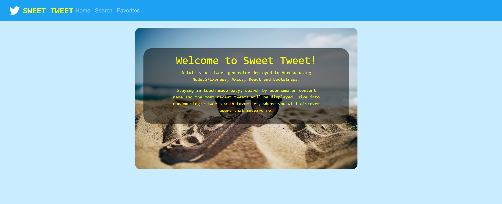
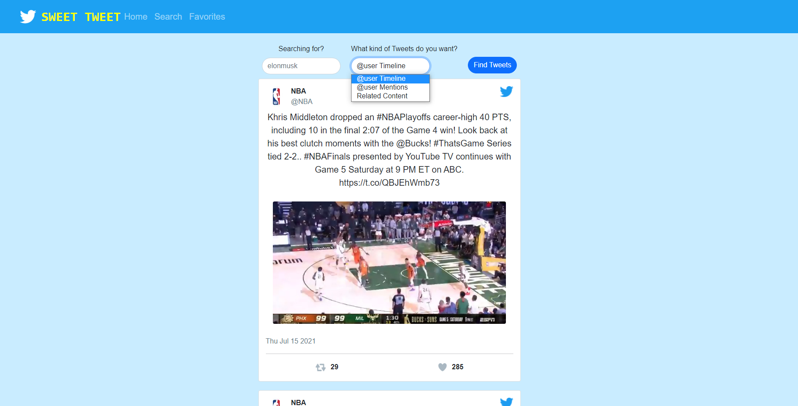

## Welcome to Sweet Tweet!

A full-stack Tweet Generator that takes data straight from the Twitter API using Axios created using NodeJs/Express, React and Bootstraps.

Try it out [here](https://fritz-sweet-tweet.herokuapp.com/)

## Navigation

Homepage:

- Brief introduction to the Project

Tweet Search:

- @user Timeline, input username to find the latest on their timeline

- @user Mentions, input username to find the latest mention on that user

- Related Content, input any word and tweets with that word will return

Favorites:

- Click any button and see a random tweet

## Summary

This full-stack application was a step away from my comfort zone. Every project I had done before this was through the frontend with React, basic HTML, CSS and JavaScript.
There are three moving parts to this application the `Front End`, `Back End`, and `Twitter API`.

The Front End uses the `React` library with `React-Router-Dom` to delivery a smooth single page application. The `Axios` library is used to make `Http GET request` to the server.
The UI was styled using `Boostrap` and `React-Bootstrap`.

The Back End server uses `NodeJs` with the `ExpressJS` framework and `Axios` to communicate with the UI and the `Twitter API`.
When the page loads, static React files are served to the client. Tweet requests from the client are handled by the server and encapsulated with a `Bearer Token`.
Data is taken directly from Twitter, organized by the server and displayed on the UI.

Twitter API sends data to the server and NOT directly to React due to the `CORS` policy. API request testing was made using `Postman` in development and deployed to `Heroku` during production.

Learn more about the technologies used:

React - https://reactjs.org/docs/getting-started.html

Axios - https://axios-http.com/docs/intro

Bootstrap - https://getbootstrap.com/docs/5.0/getting-started/introduction/

NodeJs - https://nodejs.org/en/docs/

ExpressJS - https://expressjs.com/

Twitter API - https://developer.twitter.com/en

Postman - https://www.postman.com/

Heroku - https://devcenter.heroku.com/start

Perseverance and guidance from the Software Development Mastermind Group helped me overcome some of my most difficult obstacles.
I feel a lot more confident with this introduction to the backend. This is a project that I'm proud of making.

## Instructions

In order to run this application on your local machine, follow these steps in order :

1 - Clone repo to local machine

2 - cd into `Twitter-Showcase` from where directory is saved

3 - run `npm i ` in root directory

4 - cd into `client` directory and run `npm i`

5 - In the root directory create `.env` file and use sample `env_sample`

6 - In root directory run `npm run dev`

7 - Navigate to `localhost:5000` in your browser

If you require a bearer token from Twitter, sign up and get it in https://developer.twitter.com/en

## Author

---

- **Fritz Solibio** - _Software Developer_ [LinkedIn](https://www.linkedin.com/in/fritz-solibio-4aa9b321b/) | [Website](https://www.fritzsolibio.ca/)
